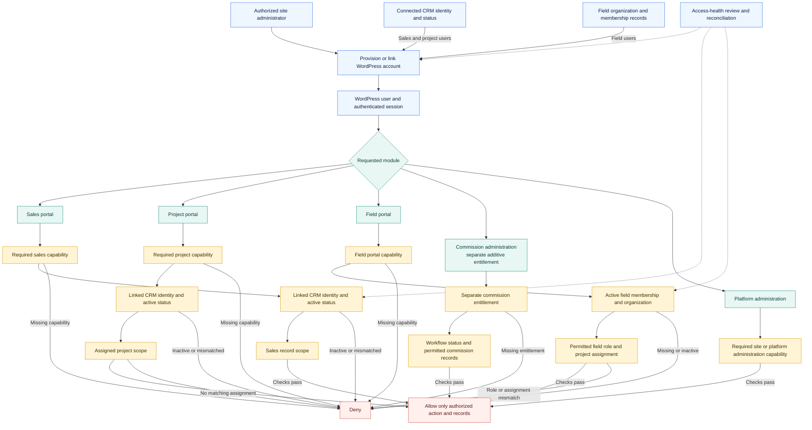

```mermaid
flowchart LR
    U[User or administrator]
    subgraph Site[Customer WordPress trust boundary]
        WP[WordPress site<br/>TLS configured by host] --> AUTH[WordPress authentication and session]
        AUTH --> ROUTE[Portal or admin request]
        ROUTE --> CAP[Role and capability check]
        CAP --> REQUEST{Request type}
        REQUEST -->|Portal request| SCOPE[Module-specific status, membership, assignment, and record-scope checks]
        REQUEST -->|Protected admin mutation| NONCE[Nonce check in protected form handlers]
        NONCE --> SCOPE
        SCOPE -->|Authorized| DATA[Portal controller and scoped data access]
        CAP -->|Denied| BLOCK[Reject request]
        NONCE -->|Invalid or missing| BLOCK
        SCOPE -->|Denied or out of scope| BLOCK
        DATA --> WDB[(WordPress site database)]
        DATA --> OAUTH[Server-side CRM OAuth client]
        MON[People and access health checks] -.-> CAP
        MON -.-> SCOPE
    end
    U -->|HTTPS| WP
    OAUTH -->|OAuth-backed API requests| CRM[Connected CRM<br/>Zoho is the initial target]
    classDef actor fill:#eef6ff,stroke:#2f6fed,color:#10223f
    classDef control fill:#fff4d6,stroke:#d99a00,color:#3f2f00
    classDef store fill:#e8f7f4,stroke:#178f80,color:#0b3d3a
    classDef denied fill:#fff0ee,stroke:#cb5146,color:#5b1813
    class U,WP,AUTH,ROUTE,CRM actor
    class CAP,REQUEST,NONCE,SCOPE control
    class DATA,WDB,OAUTH,MON store
    class BLOCK denied
```
  

<h1 align="center">PowerPortals</h1>

<strong>Business portals that fit the way your company works.</strong> 
Bring customer, sales, and project workflows together through a branded WordPress experience.

  <a href="#what-powerportals-is">Product overview</a> ·
  <a href="#portal-suite">Portal suite</a> ·
  <a href="#getting-started">Setup guide</a> ·
  <a href="#release-status">Release status</a>

---

## What PowerPortals is

PowerPortals is a modular portal platform for WordPress. It is being prepared to help organizations give customers and internal teams a clear place to complete common business workflows, while adapting the experience to each company’s brand and CRM configuration.

The product is in pre-release validation. This public repository is the **product overview and documentation home**; it intentionally does not contain PowerPortals plugin source code or installable packages.

## The portal suite

PowerPortals is being organized as a suite of focused portal experiences. Exact module availability depends on the release and license selected.

| Portal or module | What it is designed to support |
| --- | --- |
| **Customer Portal** | A branded customer-facing place to access relevant service and project information. |
| **Sales and Onboarding Portal** | Guided intake and onboarding workflows that collect information needed to start a customer relationship. |
| **Project Portal** | Project-facing views and actions for coordinating work with customers and teams. |
| **BOM add-on** | Bill of materials workflows, offered as an optional module. |
| **Commissions add-on** | Commission-related workflows, offered as an optional module. |

The goal is to configure only the modules a company needs, then expand the suite as its workflow grows.

## CRM setup and field mapping

The first integration focus is **Zoho CRM**. A setup guide is being shaped to walk administrators through connection setup, organization and user verification, required modules, and the fields each enabled portal needs.

PowerPortals is being prepared to adapt to CRM installations that already exist. The setup experience will identify required data, help map a company’s CRM fields to portal fields, and make missing prerequisites clear. Zoho is the initial target; broader CRM API support and assisted field mapping must be validated for each provider before they are described as generally available.

For early testing, use a dedicated CRM sandbox and a separate WordPress test site. Keep production credentials and customer data out of test environments.

## Getting started

PowerPortals is not yet published as a public plugin download. When a licensed release is available, the intended onboarding flow is:

1. Install the supplied PowerPortals package on a supported WordPress site.
2. Open the setup guide and enter the company name, brand assets, and portal preferences.
3. Choose the portal modules included in the license.
4. Connect Zoho CRM in a sandbox first, then verify the organization and authorized user.
5. Review the required CRM modules and map the fields used by each enabled workflow.
6. Run the setup checks, review access settings, and publish the portal pages when validation passes.

The exact requirements, supported versions, and distribution instructions will be documented with the first release.

## Product principles

- **Brand adaptable:** company identity and portal presentation should be configurable rather than tied to one customer’s brand.
- **Workflow aware:** setup should explain what each enabled portal requires and surface missing CRM prerequisites.
- **Modular:** optional capabilities can be licensed and enabled independently where supported.
- **Security minded:** integrations should use scoped credentials, protect secrets, and be tested in a sandbox before production use.
- **Transparent:** compatibility, module status, and setup requirements should be clear before installation.

## Security architecture

The diagram summarizes the main trust boundaries in the current validation build. WordPress authenticates the session; module controllers then apply the relevant capability and, where implemented, business-scope checks before accessing portal records or the connected CRM.

The boundaries are module-specific: a capability check alone does not establish access to every record. Current field-portal checks include active membership and project assignment; sales and project workflows also use their connected identity and operational status. Host controls such as TLS, account MFA, database and backup protection, and credential protection at rest must be configured and verified for each deployment. This diagram is an architecture overview, not a security certification.

## Identity and access management: roles, capabilities, and scope

PowerPortals uses WordPress users and capabilities as the authorization foundation. Portal roles grant only the module-level access they need; the relevant workflow adds identity, status, organization, or project checks before it returns scoped information. The exact role and capability set depends on the enabled modules and release.

The model separates **who can enter a module** (WordPress roles and capabilities) from **which business records they can reach** (identity status, active membership, and assignments where that module requires them). Sales and project identities are linked to CRM records; field organization membership is managed in WordPress. Administrators can review access-health findings and reconcile supported access records.

These diagrams describe the current product direction and implementation patterns, not a promise that every portal uses every check. Before general availability, each release must be tested to confirm that every read and write path enforces its documented capability and record scope.

## Release status

PowerPortals remains in pre-release productization and release-gate testing. PHP 8.3 compatibility is being validated in continuous integration and an isolated WordPress environment. The new lead-intake and service-quote form is being developed as a guided, step-by-step way for prospective customers to describe their project and request service. Its Zoho lead sync and Florida parcel lookup are also under private development and validation; these capabilities are not available as public downloads.

The descriptions here communicate product direction, not a claim that every module, CRM provider, or distribution workflow is generally available. A public package, supported-version matrix, setup guide, and commercial terms will be announced after release checks are complete.

## Screenshots and demonstrations

Verified product screenshots and short demonstrations will be added here as release-ready assets become available. Images will be reviewed to remove customer information, credentials, and other private data before publication.

## Security

Please do not post credentials, tokens, customer records, or vulnerability details in public issues. Use the repository’s **Security** tab and choose **Report a vulnerability** to send a private security report. Use public issues for product and documentation feedback only.

## Repository scope

This repository is for public product information, setup documentation, and release announcements. It does not grant a license to PowerPortals software, trademarks, or other product materials. Plugin source code and licensed installation packages are distributed separately under the terms provided with a commercial release.

---

<strong>PowerPortals</strong> One portal suite. Configured for your business.

