

  

<h1 align="center">PowerPortals</h1>

<strong>One connected portal experience, configured for your business.</strong> 
Guided project intake, customer follow-up, and Zoho CRM workflows for WordPress.

  
  
  
  

> [!IMPORTANT]
> **Pre-release product.** PowerPortals is in private development and validation. This public repository presents the product direction; it does not provide installable software, a license, or a general-availability date. The product-tour images show the current development experience using fictional demo data. They are not a compatibility guarantee or security certification.

  

## A clearer path from inquiry to project

PowerPortals is a modular WordPress portal suite designed to help service businesses collect a useful project request, route it into their CRM, and give customers a place to follow up. Organizations configure the brand, services, service area, CRM field mappings, and optional portal modules to fit their operations.

| Capture useful project detail | Connect the team workflow | Keep the customer relationship open |
|:---|:---|:---|
| Guide people through goals, service choices, property details, timing, budget context, and project photos. | Connect the intake to Zoho CRM, with setup designed around each organization’s existing modules and fields. | Offer account creation after submission. Project decisions and customer-account status are handled separately. |

## Product tour

PowerPortals brings the customer’s first project request and the team’s follow-up into one configurable experience. These screens are from an isolated test installation and use fictional sample records.

### A guided project request

Customers choose the work they have in mind, add project context, and verify the property with a satellite view. Roofing requests can branch into repair, replacement, and new-roof paths, with material selections that match the request.

<table>
  <tr>
    <td width="50%"><strong>Choose a project direction</strong> 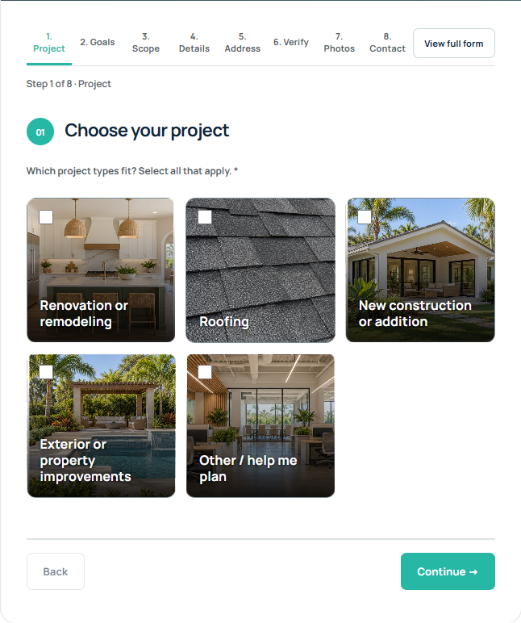</td>
    <td width="50%"><strong>Describe the property and recent purchase</strong> 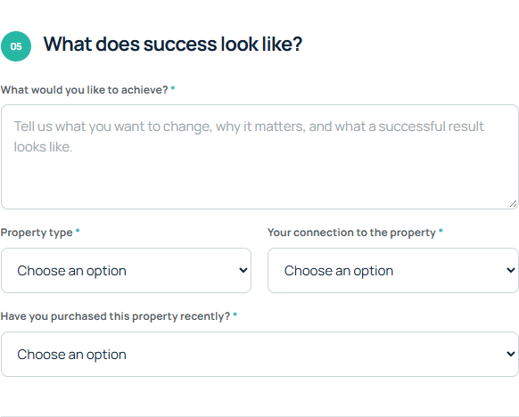</td>
  </tr>
  <tr>
    <td width="50%"><strong>Review existing roof materials</strong> 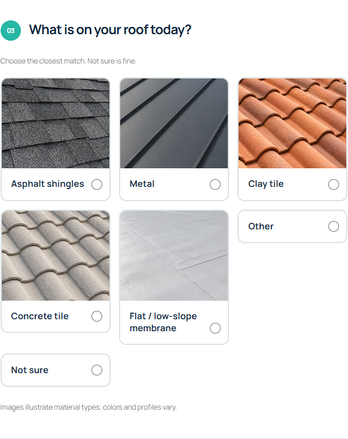</td>
    <td width="50%"><strong>Choose a target roof material</strong> 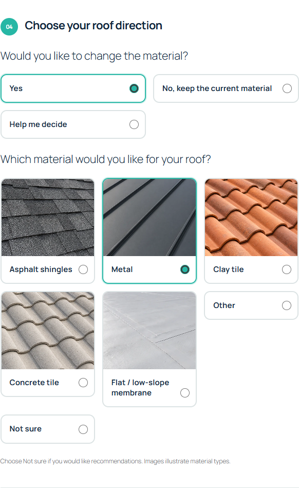</td>
  </tr>
  <tr>
    <td colspan="2"><strong>Confirm the project location</strong> 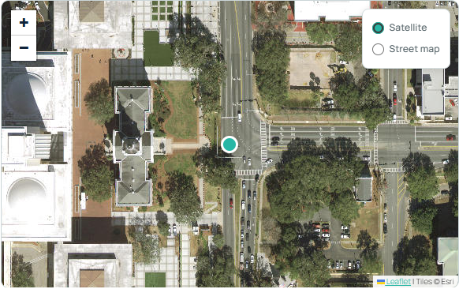</td>
  </tr>
</table>

### Connected team workspaces

The portal suite is designed to give each team a focused view of its part of the customer and project journey. These screens are illustrative module views with fictional demonstration records.

<table>
  <tr>
    <td width="50%"><strong>Sales workspace</strong> 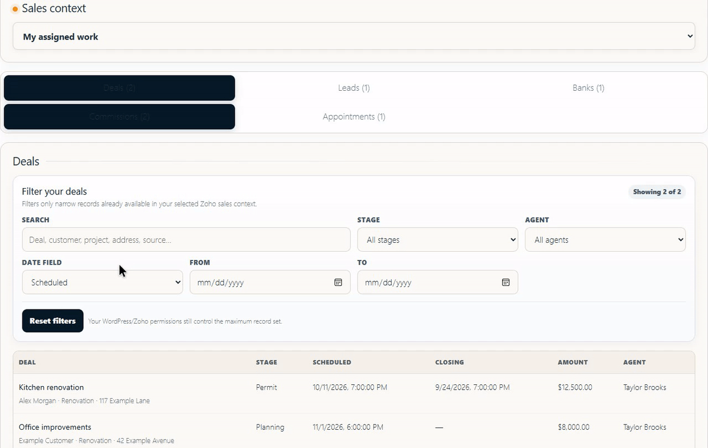</td>
    <td width="50%"><strong>Project workspace</strong> 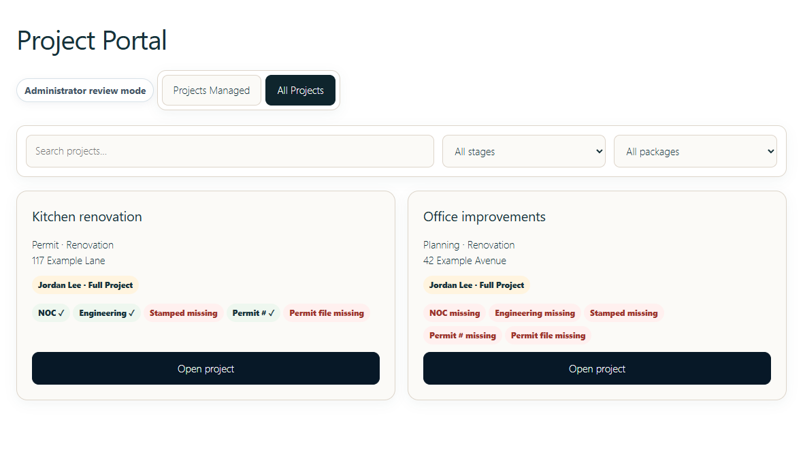</td>
  </tr>
  <tr>
    <td width="50%"><strong>Field workspace</strong> 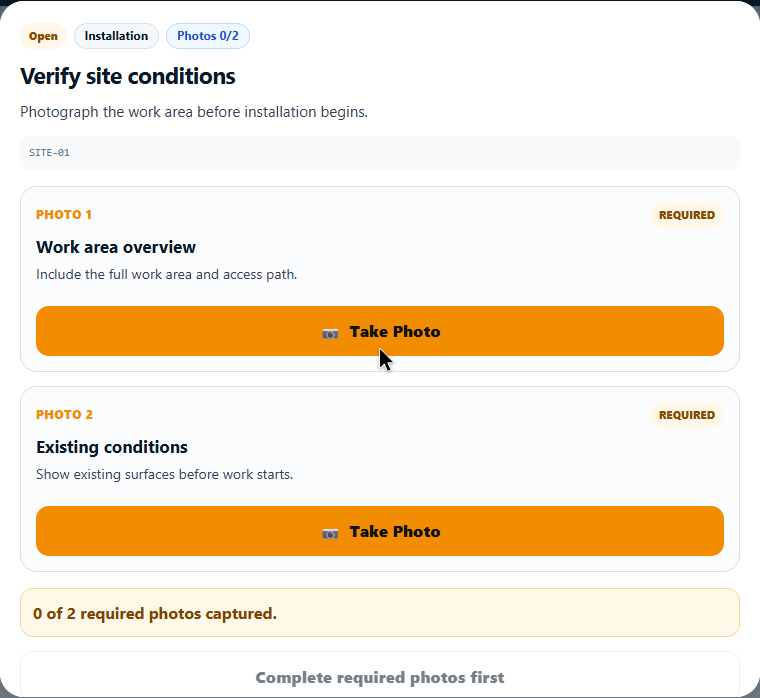</td>
    <td width="50%"><strong>Materials workspace</strong> 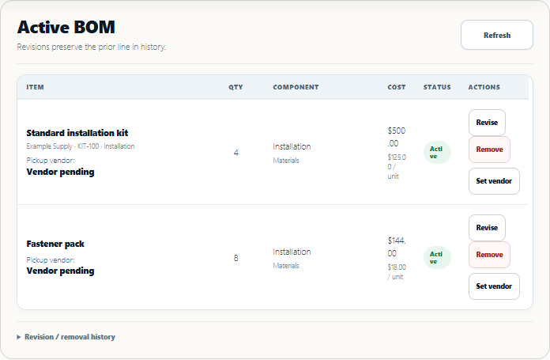</td>
  </tr>
</table>

### An optional customer hub

Customers can keep their account available even when a project does not proceed. This neutral mockup illustrates the planned hub for current requests, project history, and account details; it is a concept image rather than a screenshot of a released customer portal.

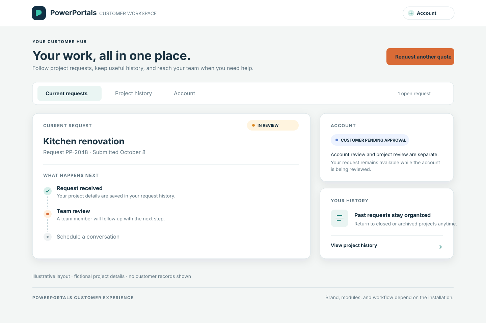

All captured screens use fictional demonstration data. The customer hub image is an illustrative concept. Product capabilities and integrations remain under private validation.

## Capabilities in private validation

The following capabilities have working development implementations or beta companions. Each remains subject to release and compatibility review before general availability.

### Guided quote and lead intake

A step-by-step flow helps customers describe what they want to accomplish, select relevant services, and provide timing, budget, scope, and photos. Customers can switch to a full-form view. Service-specific questions can capture the details needed to scope different requests, including roof repairs, replacements, and new construction.

Administrators can enable or disable service types and configure the default state and accepted-state restrictions for an installation. That allows a business to publish only the work and service area it currently supports.

### Property and parcel context

Customers can enter a property address, review a satellite map, adjust the pin, and edit coordinates directly when needed. When a selected public source returns a match, parcel identifiers and legal-description details can be shown for review. Public GIS matches are reference information; they do not establish ownership or replace county records.

Florida Parcel Finder is being developed as a separate companion for Florida property records. Coverage depends on the county and public service availability, so a match is not guaranteed statewide.

### Zoho CRM and companion widgets

Zoho CRM is the first integration target. The setup direction supports reviewing a company’s existing modules and fields and mapping PowerPortals concepts to the customer’s CRM schema. The CRM lead handoff remains under private validation.

The private beta widget suite includes:

- **Zoho Setup Assistant:** discovers module and field metadata, suggests type-compatible mappings, and exports a review draft. It does not create modules, change CRM settings, or activate mappings.
- **Florida Property Verification:** displays a record’s location and queries selected public Florida parcel sources. It does not write parcel data back to CRM, and source coverage is partial.

These Zoho widget ZIPs are private beta artifacts, not public downloads. Mapping import, optional schema provisioning, permissions, and supported-edition compatibility require further validation.

### Optional customer portal

After submitting a project request, a customer may choose to create an account. The account begins as **Customer Pending Approval**, independently of whether the project proceeds. Customers can return to view current requests and project history, and can submit another request later. A project that does not move forward can be archived while the customer account remains available.

### A modular suite

The product architecture is intended to support customer service and sales workflows first, followed by project and deal management. Materials, field operations, and other specialized capabilities can be offered as optional modules when they fit a company’s needs and the release supports them.

## Customer journey

The diagram shows the intended customer flow. CRM handoff, account onboarding, and project lifecycle behavior remain under private validation.

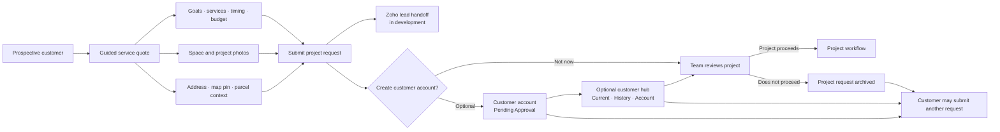

## Brand and service controls

PowerPortals is designed to adapt to the installing organization instead of presenting a single company’s identity or service catalog. Planned administrator controls include:

| Setting | What it controls |
|:---|:---|
| Brand identity | The portal’s colors, logo, and customer-facing presentation |
| Service catalog | Which service and project types customers can select |
| State rules | The default state and, when enabled, the accepted states |
| CRM mappings | How submitted information corresponds to the organization’s Zoho modules and fields |
| Portal modules | Which capabilities are enabled for that installation |

## Access architecture

WordPress provides the portal host and identity foundation. Requests are intended to pass through authentication and module-level access checks, with record-level rules for identity, status, membership, assignments, and project scope. The exact checks vary by module and must be verified for each release.

```mermaid
flowchart LR
    U[User or administrator]
    subgraph Site[Customer WordPress trust boundary]
        WP[WordPress site<br/>TLS configured by host] --> AUTH[WordPress authentication and session]
        AUTH --> ROUTE[Portal or admin request]
        ROUTE --> CAP[Role and capability check]
        CAP --> REQUEST{Request type}
        REQUEST -->|Portal request| SCOPE[Module-specific status, membership, assignment, and record-scope checks]
        REQUEST -->|Protected admin mutation| NONCE[Nonce check in protected form handlers]
        NONCE --> SCOPE
        SCOPE -->|Authorized| DATA[Portal controller and scoped data access]
        CAP -->|Denied| BLOCK[Reject request]
        NONCE -->|Invalid or missing| BLOCK
        SCOPE -->|Denied or out of scope| BLOCK
        DATA --> WDB[(WordPress site database)]
        DATA --> OAUTH[Server-side CRM OAuth client]
        MON[People and access health checks] -.-> CAP
        MON -.-> SCOPE
    end
    U -->|HTTPS| WP
    OAUTH -->|OAuth-backed API requests| CRM[Connected CRM<br/>Zoho is the initial target]
    classDef actor fill:#eef6ff,stroke:#2f6fed,color:#10223f
    classDef control fill:#fff4d6,stroke:#d99a00,color:#3f2f00
    classDef store fill:#e8f7f4,stroke:#178f80,color:#0b3d3a
    classDef denied fill:#fff0ee,stroke:#cb5146,color:#5b1813
    class U,WP,AUTH,ROUTE,CRM actor
    class CAP,REQUEST,NONCE,SCOPE control
    class DATA,WDB,OAUTH,MON store
    class BLOCK denied
```

The architecture diagram describes a control model; it is not a security certification. Hosting, TLS, account protection, backups, and credential storage must also be configured and verified for each deployment.

### Roles and record scope

The access model separates the user’s role, module entitlement, and allowed record scope. A module should expose only the actions and records permitted by the applicable checks.

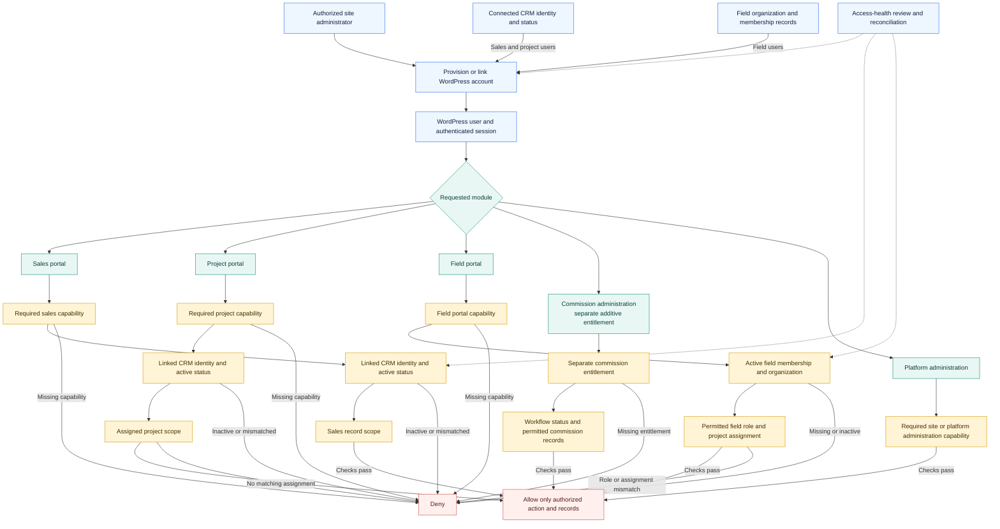

Every enabled module must be tested against its documented read and write paths before general availability.

## Intended setup

1. Install a licensed PowerPortals package on a supported WordPress site.
2. Configure the organization’s brand, service catalog, accepted states, and enabled modules.
3. Connect a Zoho sandbox, verify the organization and authorized user, and map fields for the enabled workflows.
4. Review setup and access checks, then publish portal pages when release requirements are met.

The supported-version matrix, complete setup guide, distribution instructions, and commercial terms will accompany a verified release.

## Availability and security

PowerPortals is not currently offered as a public plugin download. The lead-intake form, Zoho lead sync, Florida parcel lookup, and optional customer portal remain under private development and validation. No general-availability date is announced.

This repository is the public product overview and documentation home. It does not contain plugin source code or installable packages and does not grant a license to PowerPortals software, trademarks, or product materials.

For early testing, use a dedicated WordPress test site and Zoho sandbox. Keep production credentials and customer data out of test environments. Do not post credentials, tokens, customer records, or vulnerability details in public issues; use the repository’s **Security** tab for private vulnerability reports.

---

<strong>PowerPortals</strong> One portal suite. Configured for your business.

