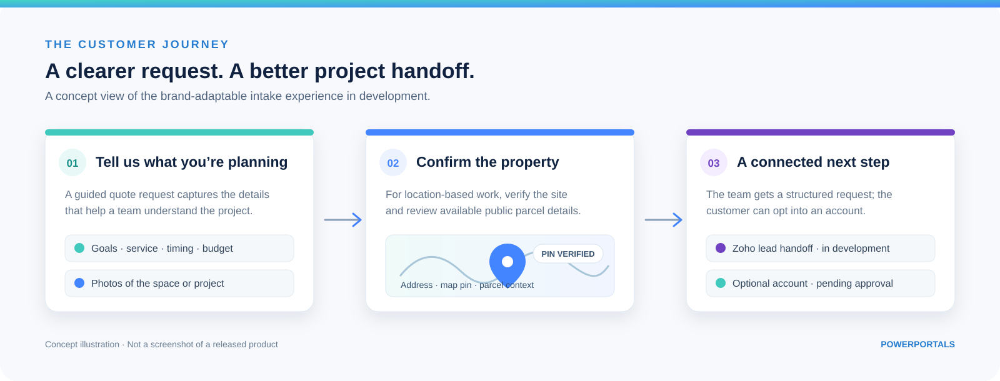
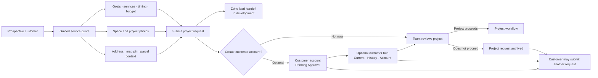
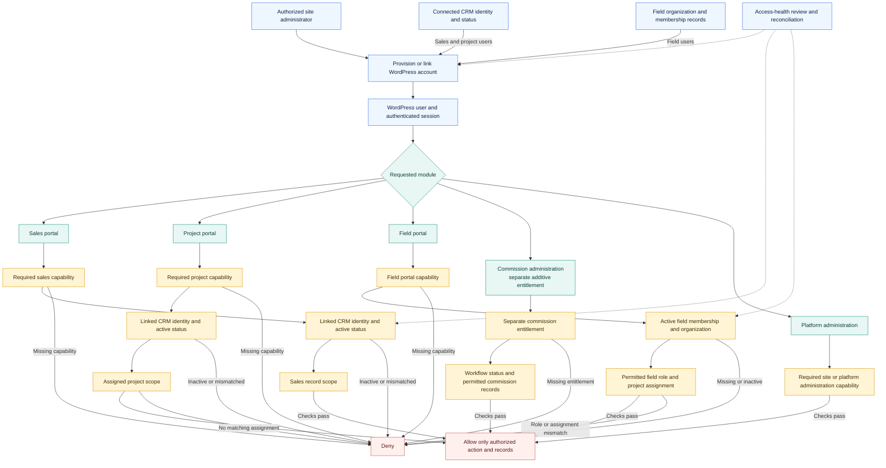

  

<h1 align="center">PowerPortals</h1>

<strong>From first request to active project—one branded portal experience.</strong> 
Guided customer intake, connected sales workflows, and project communication for WordPress.

  
  
  
  

  
  
  
  

---

  

> [!NOTE]
> **Pre-release:** The current development branch has passed PHP 8.3 automated checks and an isolated WordPress test. PowerPortals remains in private product validation. This repository is a product overview, not a public plugin download; the illustration above is a concept view, not a released-product screenshot.

## Built around the way your business works

PowerPortals is a modular portal platform for WordPress. It is being developed to carry a customer from a clear first request into an organized business workflow, using the company’s brand, services, service area, and CRM setup.

| **Capture better requests** | **Connect the handoff** | **Keep the relationship open** |
|:---|:---|:---|
| A guided service-quote experience collects project goals, service selections, property details, timing, budget context, and photos. | Zoho CRM is the first integration target, with field mapping intended to fit an organization’s existing setup. | An optional customer account is designed to stay available even when a project does not proceed, so customers can return with a new request. |

## The customer journey

The goal is a connected path from inquiry through review. Customers can submit a project request first, then choose whether to create an account. The account and project review have separate outcomes.

*This diagram shows the intended workflow. CRM connectivity, account onboarding, and project lifecycle behavior remain under private validation.*

## Features built for real intake

Explore the capabilities planned to carry a customer request from first contact through team review. Expand a feature for the details.

 

Replace a one-box contact form with a step-by-step quote request. Customers can explain their goals, select the services that apply, share project timing and budget context, and add photos of the existing space or planned work. The experience is being designed to support both a guided flow and a full-form view.

 

For property-related work, customers can provide an address, verify or adjust a map pin, and review parcel details when public records are available. Florida parcel lookup is being developed as an add-on, including fields such as folio number and legal description. Public map and parcel sources support review; they do not establish ownership or replace official county records.

 

Zoho CRM is the first integration target. The planned setup flow verifies the organization and authorized user, identifies required modules, and maps form data to the organization’s fields. Live CRM lead handling must pass further validation before general availability.

 

The private 0.3.0 candidate presents the account as a customer hub with separate **Current requests**, **Project history**, and **Account** tabs. Request cards bring the project status and next step forward, while archived requests remain available when a project does not proceed. Account creation is optional after submission; a new account begins as **Customer Pending Approval**, independently of project approval, and the customer can return to submit another request. This experience is under private validation and is not a public plugin download or a production-readiness claim.

 

The broader product is planned to include customer, sales and onboarding, and project experiences, with optional bill-of-materials and commissions add-ons. Available modules will depend on the release and license.

## Brand-ready by design

PowerPortals is being built as a brand-adaptable product rather than a form tied to one company. Administrators are intended to be able to configure:

| Control | What it shapes |
|:---|:---|
| Brand identity | The portal presentation for the organization |
| Service catalog | Which service and project types appear in intake |
| State settings | A default state and optional accepted-state restrictions |
| CRM field mapping | How submitted information fits the organization’s CRM setup |
| Portal modules | Which licensed capabilities are enabled for that installation |

## Platform and access architecture

PowerPortals uses WordPress as the portal host and identity foundation. Requests pass through WordPress authentication and module-level capability checks; workflows can also apply identity, status, membership, assignment, or record-scope checks before data is returned. The exact checks vary by module and release.

```mermaid
flowchart LR
    U[User or administrator]
    subgraph Site[Customer WordPress trust boundary]
        WP[WordPress site<br/>TLS configured by host] --> AUTH[WordPress authentication and session]
        AUTH --> ROUTE[Portal or admin request]
        ROUTE --> CAP[Role and capability check]
        CAP --> REQUEST{Request type}
        REQUEST -->|Portal request| SCOPE[Module-specific status, membership, assignment, and record-scope checks]
        REQUEST -->|Protected admin mutation| NONCE[Nonce check in protected form handlers]
        NONCE --> SCOPE
        SCOPE -->|Authorized| DATA[Portal controller and scoped data access]
        CAP -->|Denied| BLOCK[Reject request]
        NONCE -->|Invalid or missing| BLOCK
        SCOPE -->|Denied or out of scope| BLOCK
        DATA --> WDB[(WordPress site database)]
        DATA --> OAUTH[Server-side CRM OAuth client]
        MON[People and access health checks] -.-> CAP
        MON -.-> SCOPE
    end
    U -->|HTTPS| WP
    OAUTH -->|OAuth-backed API requests| CRM[Connected CRM<br/>Zoho is the initial target]
    classDef actor fill:#eef6ff,stroke:#2f6fed,color:#10223f
    classDef control fill:#fff4d6,stroke:#d99a00,color:#3f2f00
    classDef store fill:#e8f7f4,stroke:#178f80,color:#0b3d3a
    classDef denied fill:#fff0ee,stroke:#cb5146,color:#5b1813
    class U,WP,AUTH,ROUTE,CRM actor
    class CAP,REQUEST,NONCE,SCOPE control
    class DATA,WDB,OAUTH,MON store
    class BLOCK denied
```

The diagram is an architecture overview, not a security certification. Host controls such as TLS, account MFA, database and backup protection, and credential protection at rest must be configured and verified for each deployment.

### Roles, capabilities, and record scope

Portal roles establish which modules a user can enter. Module workflows then apply relevant identity, status, organization, or project checks before granting access to business records. These checks are module-specific and must be verified for each release.

These diagrams describe the product’s current architecture direction and implementation patterns. Before general availability, every enabled module must be tested to confirm that its documented access rules cover each read and write path.

## Intended setup

1. Install a licensed PowerPortals package on a supported WordPress site.
2. Configure the organization’s brand, offered services, accepted states, and licensed modules.
3. Connect a Zoho sandbox, verify the organization and authorized user, and map fields for enabled workflows.
4. Review setup and access checks, then publish portal pages when release requirements are met.

The supported-version matrix, complete setup guide, distribution instructions, and commercial terms will be published with a verified release.

## Availability

PowerPortals is not yet available as a public plugin download. The lead-intake and service-quote form, Zoho lead sync, Florida parcel lookup, and optional customer intake portal remain under private development and validation. No public package or general-availability date is being announced yet.

This repository is the public product overview and documentation home. It does not contain plugin source code or installable packages and does not grant a license to PowerPortals software, trademarks, or product materials.

## Security and testing

Integrations are being developed for scoped credentials and sandbox-first validation. Use a dedicated CRM sandbox and a separate WordPress test site for early testing; keep production credentials and customer data out of test environments. Do not post credentials, tokens, customer records, or vulnerability details in public issues. Use the repository’s **Security** tab to report a vulnerability privately.

---

<strong>PowerPortals</strong> One portal suite. Configured for your business.

